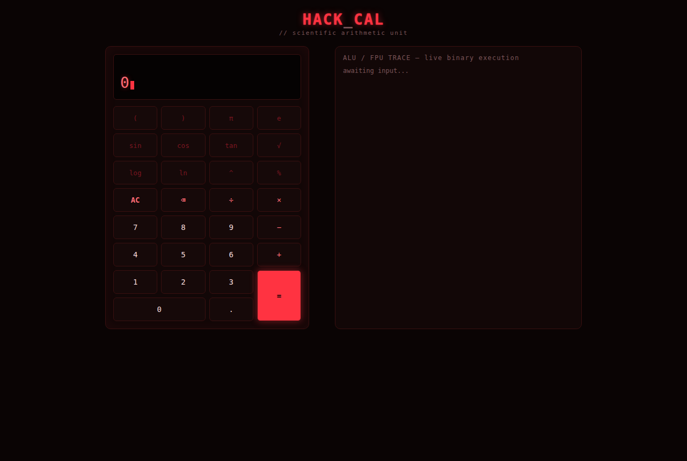
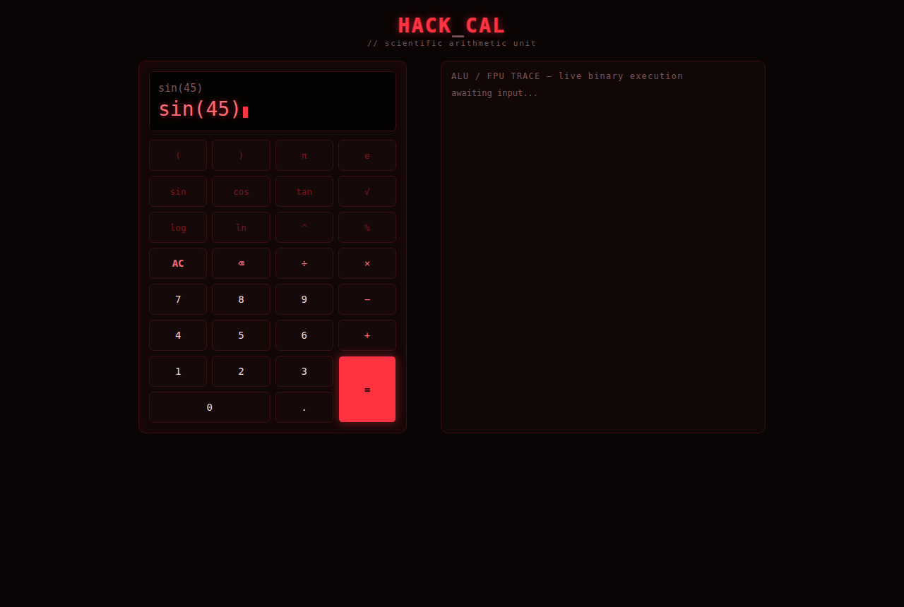
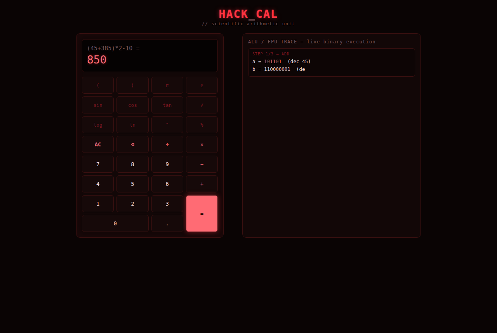
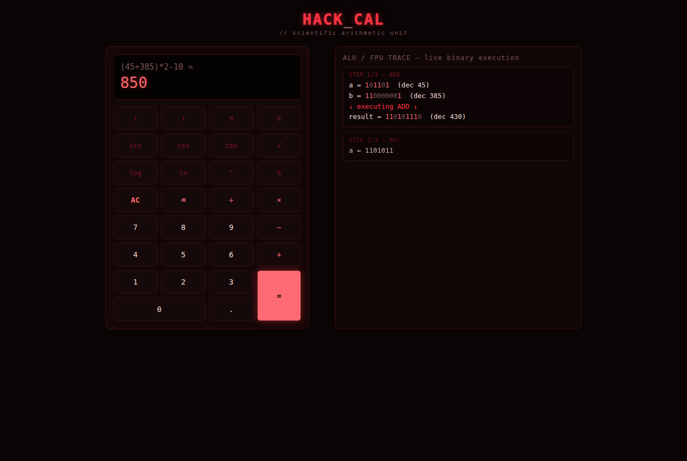
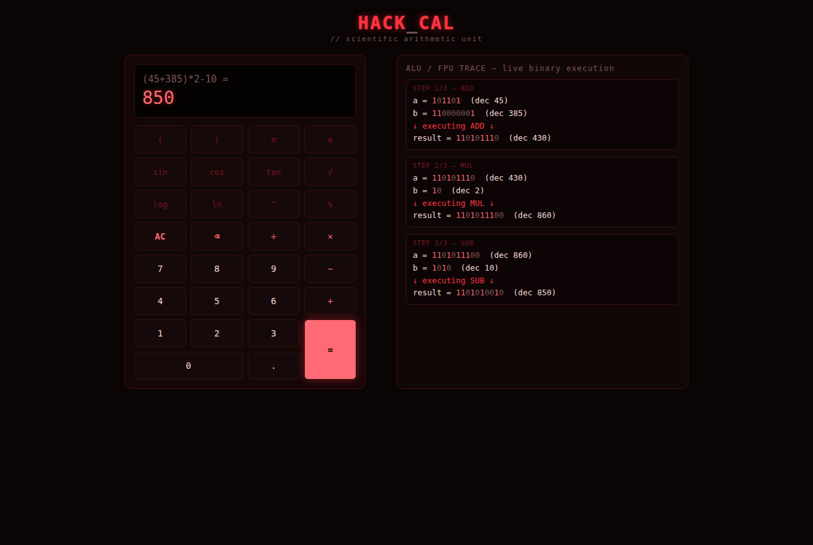
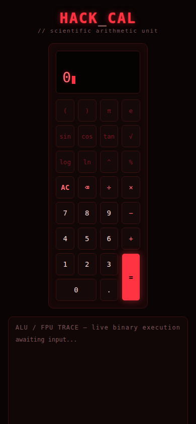

# HackCal — Scientific Binary Calculator

A scientific calculator that shows its own math happening in binary, live, as it computes.



## What it is

HackCal is a single-page scientific calculator. It looks and behaves like a normal phone calculator — one input line, tap or type an expression, hit `=` — but next to the keypad is a live trace panel. Every time an expression is evaluated, that panel animates through each individual operation the evaluator performed: it converts the numbers involved to binary and types out the operation, one character at a time, instead of dumping the final answer instantly.

## How it works

The app is built in three plain files with no framework and no build step.

**Input & parsing.** The display is a single text line, not two separate number boxes. Whatever you type or tap is kept as one expression string (e.g. `(45+385)*2-10`). On `=`, that string is tokenized and parsed with a hand-written recursive-descent parser into an expression tree, respecting normal precedence (`^` binds tighter than `× ÷`, which bind tighter than `+ −`, and parentheses override all of it).

**Evaluation & tracing.** The tree is walked node by node to compute the result. While it evaluates, every binary operation (`+ − × ÷ ^`) and every function call (`sin cos tan log ln sqrt`, plus unary `-` and `%`) is recorded into a trace list as it happens — the operand(s) and the result. Basic operators are labeled as ALU work (`ADD`, `SUB`, `MUL`, `DIV`, `POW`); transcendental functions are labeled as FPU work (`FPU SIN`, `FPU LOG10`, etc.), matching how a real processor splits that work between an integer/arithmetic unit and a floating-point unit.

**Binary conversion.** Each recorded number is converted into binary by splitting it into an integer part (repeated division by 2) and a fractional part (repeated multiplication by 2, extracting the leading bit each time, up to 14 bits).

**Animated playback.** Once evaluation finishes, the trace list is replayed step by step in the side panel: each operand's binary form is typed out character by character, then the operation is shown "executing," then the result's binary form types out the same way, before moving to the next step. Nothing is rendered all at once.

## Example

`(45 + 385) × 2 − 10 = 850`

1. **ADD** — `45` (`101101`) + `385` (`110000001`) → `430` (`110101110`)
2. **MUL** — `430` (`110101110`) × `2` (`10`) → `860` (`1101011100`)
3. **SUB** — `860` (`1101011100`) − `10` (`1010`) → `850` (`1101010010`)

The panel animates through exactly these three steps, in order, before the decimal answer settles in the display.

## Features

- Single natural expression input — type on a keyboard or tap the on-screen keys
- Scientific functions: `sin`, `cos`, `tan` (degrees), `log` (base 10), `ln`, `√`, `^`, `%`, `π`, `e`, parentheses
- Recursive-descent parser with correct operator precedence
- Animated, step-by-step binary/ALU-FPU trace panel (not an instant dump)
- Full keyboard support (`Enter` to evaluate, `Backspace`, `Escape` to clear)
- Error handling for invalid syntax, division by zero, and out-of-domain input (`sqrt` of a negative, `log`/`ln` of zero or a negative)
- Responsive layout — calculator and trace panel sit side by side on desktop, stack on narrow/mobile screens
- Red hacker/matrix visual theme with a short animated boot screen on load (skips itself if the browser/OS requests reduced motion)

Not implemented: calculation history, unit conversion, graphing, a degree/radian toggle (trig is fixed to degrees).

## Project structure

```
HackCal/
├── index.html               entry point — page structure, boot screen, keypad markup
├── style.css                all styling: theme, layout, keypad, trace panel, boot animation
├── script.js                keypad wiring, tokenizer, parser, evaluator + trace recorder,
│                             binary conversion, and the step-by-step animation logic
├── README.md
├── LICENSE
├── .gitignore
└── assets/
    └── screenshots/          screenshots used in this README
```

There is no server-side code and no dependency to install — `index.html` loads `style.css` and `script.js` directly.

## Running it

Open `index.html` in any modern browser. No build step, no install.

To serve it locally instead of opening the file directly:

```bash
python3 -m http.server 8000
# then visit http://localhost:8000/index.html
```

## Screenshots

| Main interface | Scientific input |
|---|---|
|  |  |

| Mid-animation | Trace continuing |
|---|---|
|  |  |

| Full trace after evaluation | Mobile layout |
|---|---|
|  |  |

## Live demo

Coming soon — deploy `index.html`/`style.css`/`script.js` via GitHub Pages, Netlify, or Vercel and link it here.

## Possible future work

- Degree/radian toggle
- Calculation history with recall
- Adjustable trace animation speed
- Additional color themes

## License

MIT — see [LICENSE](LICENSE).
